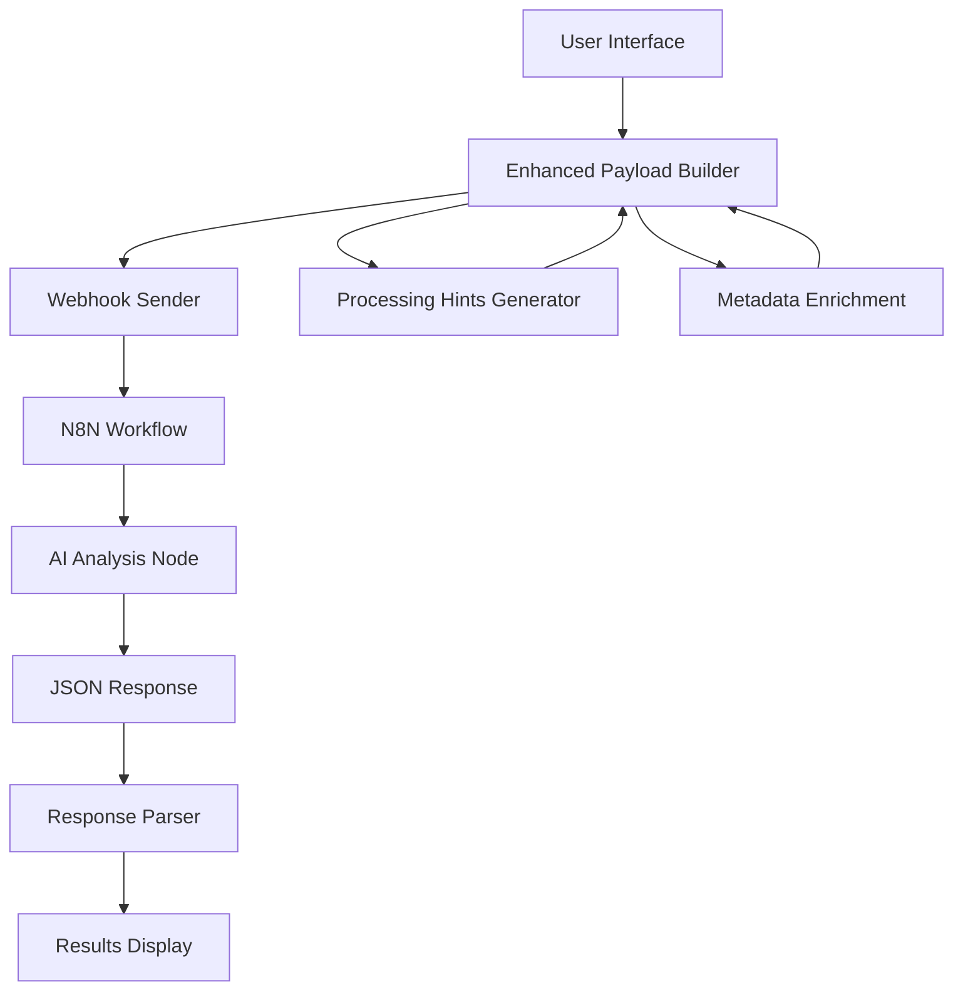

# Research Engine Architecture

The Research Engine is a comprehensive prospect analysis system that combines intelligent payload enhancement with AI-powered research through N8N workflows.

## System Overview



## Core Components

### 1. Frontend Application (React/TypeScript)
- **User Interface**: Research initiation and results display
- **Payload Enhancement**: Intelligent processing hints and metadata generation
- **Profile Management**: User and company profile storage (Supabase)
- **Results Parsing**: JSON response parsing and display

### 2. Enhanced Payload System
- **Intelligent Hints**: Dynamic processing guidance based on user/company profiles
- **Metadata Enrichment**: Context-aware metadata for personalized analysis
- **Payload Structure**: Comprehensive data package for AI analysis

### 3. N8N Integration
- **Webhook Receiver**: Accepts enhanced payload from frontend
- **AI Processing Node**: Processes payload using system prompt
- **Response Formatting**: Ensures proper JSON structure

### 4. AI Analysis Engine
- **System Prompt**: Wassching Method framework implementation
- **Dynamic Adaptation**: Analysis depth and focus based on payload hints
- **Structured Output**: Consistent JSON response format

## Data Flow

### 1. Research Initiation
```
User Profile + Company Profile + Prospect Data
↓
Processing Hints Generation (focus areas, communication style, etc.)
↓
Metadata Enrichment (experience level, company maturity, etc.)
↓
Enhanced Webhook Payload
```

### 2. N8N Processing
```
Enhanced Payload → N8N Webhook → AI Node (System Prompt) → JSON Response
```

### 3. Response Handling
```
JSON Response → Parser → Validation → Display Components
```

## Key Features

### Intelligent Payload Enhancement
- **Focus Areas**: Dynamic analysis prioritization
- **Communication Style**: Tone adaptation (professional/casual/consultative)
- **Experience Level**: Output complexity adjustment
- **Company Maturity**: Context-aware insights

### Wassching Method Integration
- 8-section comprehensive analysis framework
- Strategic fit scoring (0-100)
- Decision maker identification
- Personalized outreach recommendations

### Adaptive Analysis Depth
- **Quick Research**: Core sections (Strategic Fit + Decision-Making + Contact Strategy)
- **Standard Research**: Full 8-section analysis
- **Deep Research**: Extended competitive intelligence and financial projections

## Technology Stack

### Frontend
- **React 18** with TypeScript
- **Tailwind CSS** for styling with design system
- **Shadcn/ui** components
- **React Router** for navigation
- **React Hook Form** for form handling

### Backend Integration
- **Supabase** for data storage (profiles, research records)
- **N8N** for AI workflow orchestration
- **Webhook Integration** for payload transmission

### AI Processing
- **Claude/GPT-4** (configured in N8N)
- **Wassching Method** analysis framework
- **JSON-structured** responses

## Security Considerations

- **Environment Variables**: Webhook URLs stored securely
- **Input Validation**: Payload validation before transmission
- **Error Handling**: Comprehensive error handling and user feedback
- **Rate Limiting**: Handled at N8N workflow level

## Performance Optimization

- **Payload Compression**: Efficient data structure
- **Async Processing**: Non-blocking webhook requests
- **Response Caching**: Results stored in Supabase
- **Loading States**: User feedback during processing

## Scalability

- **Stateless Design**: No server-side state management
- **N8N Scaling**: Horizontal scaling through N8N
- **Database Optimization**: Efficient Supabase queries
- **Component Architecture**: Modular, reusable components