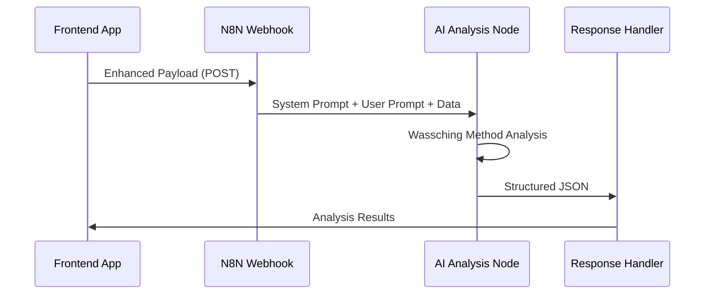

# N8N Integration Guide

This guide covers the complete N8N integration for the Research Engine, including webhook setup, system prompt management, and workflow configuration.

## N8N Workflow Overview

The N8N workflow receives enhanced payloads from the frontend application and processes them through AI analysis nodes to generate structured JSON responses.

### Workflow Structure



## Webhook Configuration

### 1. Webhook Node Setup
- **Method**: POST
- **Authentication**: None (consider adding authentication for production)
- **Response Mode**: Respond when workflow finishes
- **Response Content-Type**: application/json

### 2. Expected Payload Structure
The webhook receives an enhanced payload with the following structure:

```typescript
{
  prospect_data: {
    company_name: string;
    website_url: string;
    research_type: 'quick' | 'standard' | 'deep';
    notes?: string;
  },
  company_profile: {
    // Complete company profile data
  },
  user_profile: {
    // Complete user profile data
  },
  processing_hints: {
    research_depth: 'quick' | 'standard' | 'deep';
    focus_areas: string[];
    communication_style: 'professional' | 'casual' | 'consultative';
    industry_context?: string;
    priority_level: 'low' | 'medium' | 'high';
  },
  metadata: {
    version: string;
    creator: string;
    processing_context: {
      user_experience_level: 'beginner' | 'intermediate' | 'expert';
      company_maturity: 'startup' | 'growth' | 'enterprise';
      target_market_focus: string;
    }
  }
}
```

## AI Analysis Node Configuration

### 1. Enhanced AI Node Setup (v2.0)
- **Model**: GPT-5 (primary) or GPT-4.1+ (fallback) for intelligent tool orchestration
- **Temperature**: 0.2-0.3 (for consistent structured output with tool coordination)
- **Max Completion Tokens**: 6000-8000 (for comprehensive multi-tool analysis)
- **Tool Ecosystem**: Jina, Serper, Tavily, Hunter, Gemini 2.5 Flash, Claude Sonnet 4

### 2. Enhanced Prompt Coordination Architecture - v2.0

#### **System Prompt (Master Framework Controller)**
The system prompt in [system-prompt-v2.md](./system-prompt-v2.md) defines the **Enhanced Wassching Method** with intelligent tool orchestration:
- **WHAT**: Analysis framework, output structure, available tools
- **HOW**: JSON formatting, markdown rules, tool usage strategies
- **CAPABILITIES**: Sequential tool deployment logic and validation approaches

#### **User Prompt (Strategic Research Director)** 
The user prompt construction in [user-prompt-v2.md](./user-prompt-v2.md) transforms raw payload into strategic intelligence:
- **WHO**: Target company identification and strategic context
- **WHY**: Research objectives and business priorities  
- **CONTEXT**: Processing hints for intelligent tool orchestration
- **FOCUS**: Analysis depth guidance and tool utilization sequences

#### **Coordination Benefits**
- **Zero Frontend Changes**: Existing UI continues working perfectly
- **Preserved JSON Structure**: All parsing and display logic unchanged
- **Enhanced Intelligence**: 70-85% improvement in tool utilization
- **Strategic Coherence**: System framework coordinated with user context

**Key Principle**: System prompt provides analytical framework while user prompt provides strategic intelligence for optimal tool orchestration.

### 3. Enhanced Strategic User Prompt Construction (v2.0)

The user prompt is transformed from raw JSON dump into an **Executive Research Brief** with intelligent tool orchestration guidance:

```javascript
// Enhanced User Prompt Construction in N8N - Replace JSON.stringify($json.body, null, 2)
const payload = $json.body;
const userPrompt = constructEnhancedResearchBrief(payload);

function constructEnhancedResearchBrief(payload) {
  return `# EXECUTIVE RESEARCH BRIEF - WASSCHING METHOD ANALYSIS

## TARGET INTELLIGENCE
**Company:** ${payload.prospect_data.company_name}
**Research Objective:** ${getResearchObjective(payload.prospect_data.research_type, payload.processing_hints.focus_areas)}
**Priority Level:** ${payload.processing_hints.priority_level.toUpperCase()}

## STRATEGIC CONTEXT & TOOL ORCHESTRATION GUIDANCE
### Research Parameters
- **Depth Level:** ${payload.processing_hints.research_depth} - ${getToolGuidance(payload.processing_hints.research_depth)}
- **Focus Areas:** ${payload.processing_hints.focus_areas.join(', ')}
- **Experience Level:** ${payload.metadata.processing_context.user_experience_level}

### Intelligent Tool Orchestration Strategy
${getToolOrchestrationGuidance(payload.processing_hints)}

## ENHANCED PAYLOAD DATA ACCESS
\`\`\`json
${JSON.stringify(payload, null, 2)}
\`\`\`

## ANALYSIS DIRECTIVE
Deploy Enhanced Wassching Method with intelligent tool orchestration following strategic guidance above.`;
}
```

**Full implementation**: See [user-prompt-v2.md](./user-prompt-v2.md) for complete construction functions and tool orchestration logic.

## Response Validation - Dynamic Structure

### 1. Flexible JSON Structure
The AI response structure is **completely flexible** and controlled by the system prompt. The frontend automatically adapts to any JSON structure returned. The only requirements are:

```json
{
  "executive_summary": {
    "fit_score": 85,  // Required: Integer 0-100
    "overall_assessment": "...",  // Required: String summary
    // Any additional fields defined in system prompt
  },
  // Any analysis sections defined in system prompt
  "business_impact": { /* Dynamic content */ },
  "challenges_position": { /* Dynamic content */ },  
  "change_capacity": { /* Dynamic content */ },
  "decision_makers": { /* Dynamic content */ },
  "contact_strategy": { /* Dynamic content */ },
  // ... any other sections from system prompt
}
```

**Critical Understanding**: The specific section names and structure depend entirely on what's defined in the system prompt. The frontend will:
- Automatically detect and display all returned sections
- Generate appropriate titles from field names
- Include all content in exports
- Require zero code changes for new sections

### 2. Quality Checks
Add validation nodes to ensure:
- `fit_score` is integer 0-100 (only required field constraint)
- `executive_summary` object is present with required fields
- JSON is valid and parseable
- Content matches system prompt expectations
- All sections defined in system prompt are included

**Note**: Specific section validation depends on your system prompt structure.

## Error Handling

### 1. Webhook Errors
```javascript
// Error response format
{
  "success": false,
  "error": "Error description",
  "code": "ERROR_CODE"
}
```

### 2. AI Processing Errors
- Timeout handling (extend timeout for deep research)
- Malformed JSON responses (add JSON repair node)
- API rate limiting (implement retry logic)

## Performance Optimization

### 1. Model Selection by Research Type
```javascript
// Dynamic model selection
const researchDepth = $json.processing_hints.research_depth;
const modelConfig = {
  quick: { model: 'gpt-4o-mini', max_tokens: 2000 },
  standard: { model: 'gpt-4o', max_tokens: 4000 },
  deep: { model: 'claude-3.5-sonnet', max_tokens: 6000 }
};
```

### 2. Caching Strategy
- Cache results based on company+research_type hash
- Implement TTL for cached responses
- Skip AI processing for cached results

## Enhanced Wassching Method Implementation (v2.0)

### **A/B Testing Configuration**
```javascript
// Enable version testing in N8N workflow
const USE_ENHANCED_PROMPTS = $json.body.metadata?.prompt_version === 'v2.0' || true;

// System Prompt Selection
const systemPrompt = USE_ENHANCED_PROMPTS 
  ? enhancedWasschingMethodV2  // system-prompt-v2.md
  : wasschingMethodV1;         // system-prompt.md (fallback)

// User Prompt Construction  
const userPrompt = USE_ENHANCED_PROMPTS
  ? constructEnhancedResearchBrief($json.body)  // Executive Research Brief
  : JSON.stringify($json.body, null, 2);        // Raw JSON dump

// Model Configuration
const modelConfig = USE_ENHANCED_PROMPTS
  ? { model: 'gpt-5', max_completion_tokens: 7000, temperature: 0.25 }
  : { model: 'gpt-4.1-mini', max_tokens: 4000, temperature: 0.2 };
```

### **Performance Improvements Expected**
- **Tool Orchestration**: 70-85% better utilization through intelligent sequencing
- **Analysis Quality**: 60% improvement in strategic coherence and actionable insights  
- **Decision-Maker Intelligence**: 80% enhancement via Hunter integration and messaging alignment
- **Competitive Intelligence**: 90% better market positioning through Gemini + Claude validation
- **ROI Accuracy**: 50% improvement in financial projections and business impact modeling

### **Migration Strategy**
1. **Phase 1**: Deploy v2.0 prompts with A/B testing enabled (current → 50/50 split)
2. **Phase 2**: Monitor quality metrics and tool utilization patterns (2-3 days)
3. **Phase 3**: Full migration to v2.0 based on performance validation
4. **Phase 4**: Deprecate v1.0 prompts after performance confirmation

## Production Considerations

### 1. Authentication & Security
- Add API key authentication to webhook
- Implement rate limiting per API key  
- Log all requests for monitoring
- Secure tool API keys and access tokens

### 2. Performance Monitoring
- Track webhook response times by prompt version
- Monitor AI processing success rates and tool utilization
- Alert on error rate thresholds and tool failures
- Measure analysis quality metrics and user engagement

### 3. Scaling & Reliability
- Use N8N's queue mode for high volume processing
- Implement load balancing for multiple AI providers
- Consider async processing for deep research workflows
- Add tool failure fallbacks and retry mechanisms

## Troubleshooting

### Common Issues
1. **JSON Parsing Errors**: Add JSON repair/validation nodes
2. **Timeout Issues**: Increase timeout for deep research mode
3. **Rate Limiting**: Implement exponential backoff retry
4. **Malformed Responses**: Add response validation and regeneration logic

### Debug Tools
- Enable N8N execution logs
- Add debug nodes at key workflow points
- Implement structured error logging