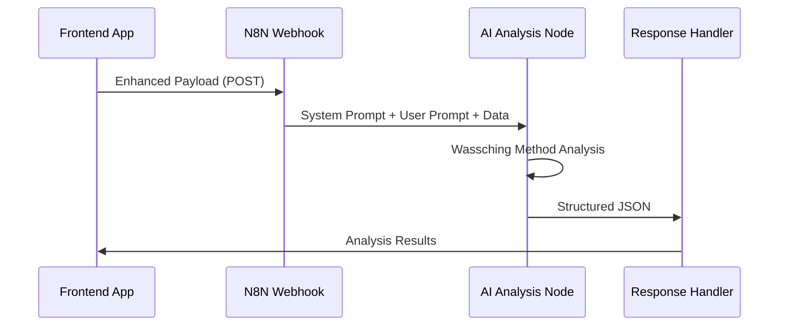

# N8N Integration Guide

This guide covers the complete N8N integration for the Research Engine, including webhook setup, system prompt management, and workflow configuration.

## N8N Workflow Overview

The N8N workflow receives enhanced payloads from the frontend application and processes them through AI analysis nodes to generate structured JSON responses.

### Workflow Structure



## Webhook Configuration

### 1. Webhook Node Setup
- **Method**: POST
- **Authentication**: None (consider adding authentication for production)
- **Response Mode**: Respond when workflow finishes
- **Response Content-Type**: application/json

### 2. Expected Payload Structure
The webhook receives an enhanced payload with the following structure:

```typescript
{
  prospect_data: {
    company_name: string;
    website_url: string;
    research_type: 'quick' | 'standard' | 'deep';
    notes?: string;
  },
  company_profile: {
    // Complete company profile data
  },
  user_profile: {
    // Complete user profile data
  },
  processing_hints: {
    research_depth: 'quick' | 'standard' | 'deep';
    focus_areas: string[];
    communication_style: 'professional' | 'casual' | 'consultative';
    industry_context?: string;
    priority_level: 'low' | 'medium' | 'high';
  },
  metadata: {
    version: string;
    creator: string;
    processing_context: {
      user_experience_level: 'beginner' | 'intermediate' | 'expert';
      company_maturity: 'startup' | 'growth' | 'enterprise';
      target_market_focus: string;
    }
  }
}
```

## AI Analysis Node Configuration

### 1. AI Node Setup
- **Model**: Claude-3.5-Sonnet or GPT-4 (recommended for quality)
- **Temperature**: 0.1-0.3 (for consistent, structured output)
- **Max Tokens**: 4000-6000 (depending on research depth)

### 2. System Prompt
The system prompt is stored in [system-prompt.md](./system-prompt.md) and should be copied into the AI node's system prompt field.

### 3. User Prompt Construction
The user prompt is dynamically constructed from the payload data:

```javascript
// Example user prompt construction in N8N
const payload = $json;
const userPrompt = `Analyze ${payload.prospect_data.company_name} (${payload.prospect_data.website_url}) for business development opportunities.

Research Context:
- Research Type: ${payload.processing_hints.research_depth}
- Communication Style: ${payload.processing_hints.communication_style}
- User Experience Level: ${payload.metadata.processing_context.user_experience_level}
- Focus Areas: ${payload.processing_hints.focus_areas.join(', ')}
- Priority Level: ${payload.processing_hints.priority_level}

Additional Context: ${payload.prospect_data.notes || 'No additional context provided.'}

Please provide comprehensive analysis following the Wassching Method framework.`;
```

## Response Validation

### 1. JSON Structure Validation
The AI response should match this exact structure:

```json
{
  "executive_summary": {
    "fit_score": 85,
    "overall_assessment": "High-potential prospect with strong strategic alignment",
    "key_opportunities": ["opportunity 1", "opportunity 2", "opportunity 3"],
    "engagement_priority": "high",
    "estimated_timeline": "2-3 months to initial engagement"
  },
  "analysis": {
    "1_strategic_fit_relevance": { /* ... */ },
    "2_organization_decision_making": { /* ... */ },
    "3_change_capacity_digital_maturity": { /* ... */ },
    "4_current_challenges_market_position": { /* ... */ },
    "5_technology_innovation_profile": { /* ... */ },
    "6_business_impact_financial": { /* ... */ },
    "7_contact_strategy_approach": { /* ... */ },
    "8_personalized_outreach_recommendations": { /* ... */ }
  },
  "actionable_next_steps": { /* ... */ },
  "risk_assessment": { /* ... */ }
}
```

### 2. Quality Checks
Add validation nodes to ensure:
- `fit_score` is integer 0-100
- All required sections are present
- Decision makers include specific personas
- Business impact includes quantified projections

## Error Handling

### 1. Webhook Errors
```javascript
// Error response format
{
  "success": false,
  "error": "Error description",
  "code": "ERROR_CODE"
}
```

### 2. AI Processing Errors
- Timeout handling (extend timeout for deep research)
- Malformed JSON responses (add JSON repair node)
- API rate limiting (implement retry logic)

## Performance Optimization

### 1. Model Selection by Research Type
```javascript
// Dynamic model selection
const researchDepth = $json.processing_hints.research_depth;
const modelConfig = {
  quick: { model: 'gpt-4o-mini', max_tokens: 2000 },
  standard: { model: 'gpt-4o', max_tokens: 4000 },
  deep: { model: 'claude-3.5-sonnet', max_tokens: 6000 }
};
```

### 2. Caching Strategy
- Cache results based on company+research_type hash
- Implement TTL for cached responses
- Skip AI processing for cached results

## Production Considerations

### 1. Authentication
- Add API key authentication to webhook
- Implement rate limiting per API key
- Log all requests for monitoring

### 2. Monitoring
- Track webhook response times
- Monitor AI processing success rates
- Alert on error rate thresholds

### 3. Scaling
- Use N8N's queue mode for high volume
- Implement load balancing for multiple AI providers
- Consider async processing for deep research

## Troubleshooting

### Common Issues
1. **JSON Parsing Errors**: Add JSON repair/validation nodes
2. **Timeout Issues**: Increase timeout for deep research mode
3. **Rate Limiting**: Implement exponential backoff retry
4. **Malformed Responses**: Add response validation and regeneration logic

### Debug Tools
- Enable N8N execution logs
- Add debug nodes at key workflow points
- Implement structured error logging